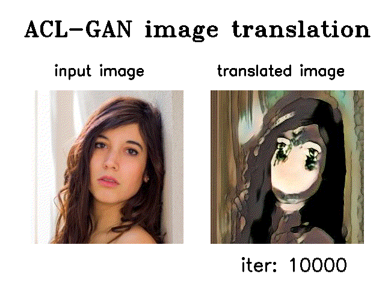

# UNOFFICIAL ACL-GAN repo for selfie2anime (including a pretrained model)

So far(Oct, 25, 2020), it seems official ACL-GAN's trained models are not available.   
I wanted to try a selfie2anime model, so I trained it from scratch.  
A model is uploaded at `models/gen_00570000.7z`. I compressed a model to avoid github limit size.

## Model Training Condition
My models wasn't trained along original way.  
I used [@xunings's (unofficial) config file](https://github.com/xunings/ACL-GAN/blob/try_20200916/configs/selfie2anime.yaml). thx ;-)

Original paper says, models were trained for 350K iter and batch_size is `3`. However, I reduce batch size parameter as below and trained for `350K * 3` iterations, due to my poor GPU resources. Sorry for a little complicated way.
1. Until 90,000 iter, batch_size is `1` 
2. Until 570,000 iter, batch_size is `2`

Notice I FORGOT changing `step_size`. So the latter part of train may not work.

### Code usage
For test: 

First, you need to extract `models/gen_00570000.7z`.  
And then,

`$ python test.py --config configs/selfie2anime.yaml --input <YOUR IMAGE_FILE PATH>  --output_folder <YOUR OUTPUT_DIR PATH> --checkpoint ./models/test.pth` 

e.g. `$ mkdir results; python test.py --config configs/selfie2anime.yaml --input inputs/test_male.jpg --output_folder results --checkpoint ./models/gen_00570000.pt`   

# link
- [original repo](https://github.com/hyperplane-lab/ACL-GAN)

